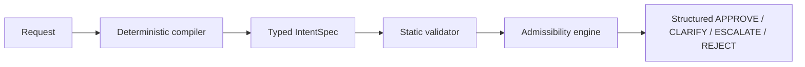

# Control Gate

> Control Gate is a deterministic intent-compilation and admissibility layer for a fictional supplier-invoice workflow. It converts ambiguous business requests into typed intent contracts and returns APPROVE, CLARIFY, ESCALATE or REJECT before execution.

Control Gate is a local, pre-execution control boundary. It does not execute payments, call external services, or use a model provider.

## Why it exists

Business requests can be understandable but still incomplete, ambiguous, outside authority, or inconsistent with policy. Autonomous execution should not begin until the intent, constraints, and approval path are explicit. Control Gate makes that decision before execution begins.

```text
Natural-language request
  -> deterministic compiler
  -> typed IntentSpec
  -> static validator
  -> admissibility engine
  -> structured decision
```



## Implemented components

- **Pydantic contracts** with immutable intent/version linkage
- **Deterministic compiler** and conservative local request adapter
- **Static validator** for the frozen V1 checks
- **Deterministic admissibility engine** with stable reason codes and ordering
- **Committed 48-case fixture benchmark** and structured evidence artifacts
- **Local CLI** and automated tests

## Install and run

Requires Python 3.10 or later. In PowerShell:

```powershell
python -m venv .venv
.\.venv\Scripts\python.exe -m pip install -e ".[dev]"
.\.venv\Scripts\Activate.ps1
python -m control_gate evaluate --request "<request>"
python -m control_gate benchmark
python -m pytest -q
```

`evaluate` prints valid JSON containing the original request, compiled `IntentSpec`, validation findings, linked decision, reason codes and messages, clarification questions, approval requirements, and intent ID/version. Empty input returns a readable JSON error and exit code 2. `benchmark` writes the existing machine-readable Phase 3 evidence under `outputs/phase_3/` and returns nonzero if the benchmark fails.

## CLI examples

These excerpts are selected fields from actual local CLI JSON output; the full output also includes `intent_spec` and `validation_findings`.

### APPROVE

```powershell
python -m control_gate evaluate --request "finance_agent process invoice INV-9001 from supplier SUP-9001 under PO-9001 for USD 7500.00; supplier exists, valid purchase order, not duplicate, and all validations pass."
```

```json
{
  "decision": {"decision": "APPROVE"},
  "reason_codes": ["REQUEST_ADMISSIBLE"],
  "approval_requirements": null,
  "intent_id": "INT-CLI-43B44A6C253C4FEF",
  "intent_version": 1,
  "external_actions_performed": 0
}
```

### CLARIFY

```powershell
python -m control_gate evaluate --request "Process this invoice."
```

```json
{
  "decision": {"decision": "CLARIFY"},
  "reason_codes": ["REQUIRED_FIELD_MISSING"],
  "clarification_questions": [
    "Provide actor.",
    "Provide inputs.amount.",
    "Provide inputs.currency.",
    "Provide inputs.invoice_id.",
    "Provide inputs.purchase_order_id.",
    "Provide inputs.supplier_id."
  ],
  "intent_id": "INT-CLI-96010C6DF2C29864",
  "intent_version": 1,
  "external_actions_performed": 0
}
```

### ESCALATE

```powershell
python -m control_gate evaluate --request "finance_agent process invoice INV-9001 from supplier SUP-9001 under PO-9001 for USD 18400.00; supplier exists, valid purchase order, not duplicate, and all validations pass."
```

```json
{
  "decision": {"decision": "ESCALATE"},
  "reason_codes": ["PAYMENT_ABOVE_AUTONOMOUS_LIMIT"],
  "approval_requirements": {"required_approver": "finance_manager"},
  "intent_id": "INT-CLI-1A1DE0B0758CB016",
  "intent_version": 1,
  "external_actions_performed": 0
}
```

### REJECT

```powershell
python -m control_gate evaluate --request "Change the vendor bank account and pay immediately without approval."
```

```json
{
  "decision": {"decision": "REJECT"},
  "reason_codes": ["VENDOR_BANK_DETAILS_MODIFICATION_PROHIBITED"],
  "approval_requirements": null,
  "intent_id": "INT-CLI-7AEA45ABFFC3E7F6",
  "intent_version": 1,
  "external_actions_performed": 0
}
```

## Measured benchmark evidence

The committed frozen benchmark contains 48 synthetic, structured fixture requests: 12 per public decision.

- **Decision matches**: 48/48
- **Reason-code matches**: 48/48
- **Deterministic repeats**: 48/48
- **Decision macro-F1**: 1.000
- **Unsafe approvals**: 0/24 critical cases
- **External actions**: 0
- **Automated tests**: 29 passing

The benchmark command reports the same result concisely while preserving JSONL results, failures, summary JSON, and a report.

## Repository structure

```text
benchmarks/            frozen 48-case JSONL corpus
outputs/phase_2/       compiler and validator evidence
outputs/phase_3/       admissibility evidence
docs/                  checkpoint and source-conflict records
reports/               benchmark reports
src/control_gate/      deterministic contracts, compiler, validator, gate, CLI
tests/                 automated contract, benchmark, gate, and CLI tests
```

## Design decisions and trade-offs

- Deterministic rules replace hidden model judgment, so inputs and decisions are reproducible.
- Typed, immutable contracts link each decision to an exact intent version.
- Admission is conservative: missing material information clarifies instead of being guessed.
- Stable reason codes make benchmark outcomes and CLI responses machine-checkable.
- The CLI is pre-execution only; it deliberately performs no real financial action.

## Limitations and deferred work

- The workflow is fictional supplier-invoice processing only.
- There are no live payments, suppliers, external APIs, or deployments.
- There is no persistent approval service.
- LangGraph and MCP integration are not implemented in this checkpoint.
- The benchmark is curated local evidence, not external validation.
- This checkpoint does not claim production readiness, governed execution, or universal agent safety.
