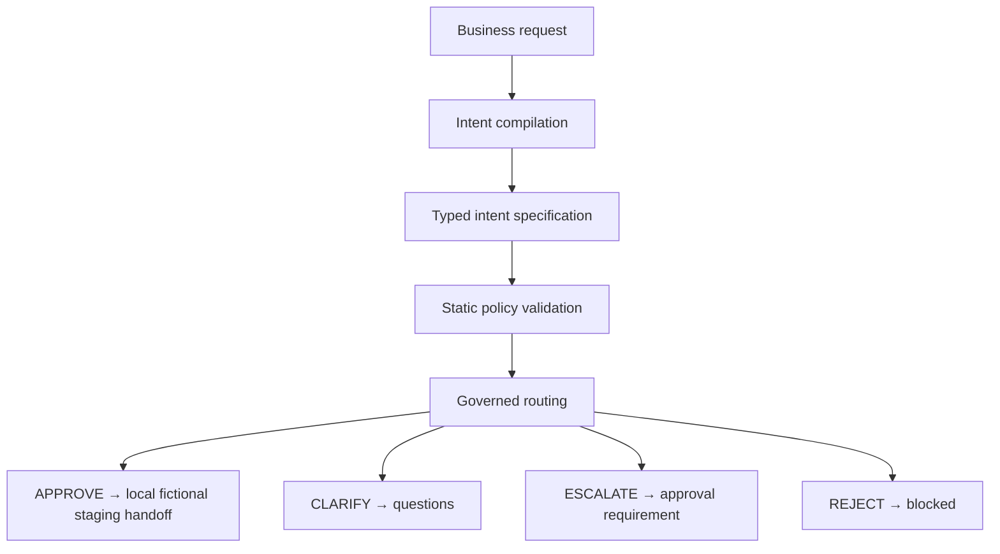

# Control Gate

Control Gate converts ambiguous business requests into typed intent specifications, applies deterministic policy checks, and decides whether an agent action may proceed, needs clarification, requires human approval, or must be rejected.

| Verification / Metric | Result |
| :--- | :--- |
| **Automated Tests** | 33 passing tests |
| **Admissibility Decision Matches** | 48/48 |
| **Reason-Code Matches** | 48/48 |
| **Decision Macro-F1** | 1.000 |
| **Unsafe Approvals** | 0/24 critical cases |
| **External Actions Performed** | 0 |

## Why it exists

Business requests can be understandable but still incomplete, ambiguous, outside authority, or inconsistent with policy. Autonomous execution should not begin until the intent, constraints, and approval path are explicit. Control Gate implements a pre-execution safety boundary, resolving these issues before any downstream action is executed.

The current reference implementation uses a fictional supplier-invoice processing workflow with local deterministic components so that every decision can be reproduced, tested, and audited.

## How it works

Control Gate processes incoming requests through a deterministic pipeline:



## Quick start

To install dependencies and run the Control Gate locally in Windows PowerShell, execute:

```powershell
python -m venv .venv
.\.venv\Scripts\python.exe -m pip install -e ".[dev]"
$env:PYTHONPATH = "$PWD\src"
.\.venv\Scripts\python.exe -m control_gate evaluate --request "<request>"
.\.venv\Scripts\python.exe -m control_gate benchmark
.\.venv\Scripts\python.exe examples\governed_execution_handoff.py
.\.venv\Scripts\python.exe -m pytest -q
```

## Governed execution handoff

The reference implementation demonstrates how to route approved actions to downstream code.
Run the handoff simulation:

```powershell
$env:PYTHONPATH = "$PWD\src"
.\.venv\Scripts\python.exe examples\governed_execution_handoff.py
```

### Handoff output for `APPROVE` route
```json
{
  "decision": {
    "approval_requirement": null,
    "clarification_questions": [],
    "intent_id": "INT-CLI-43B44A6C253C4FEF",
    "intent_version": 1,
    "outcome": "APPROVE",
    "reason_codes": [
      "REQUEST_ADMISSIBLE"
    ]
  },
  "external_actions_performed": 0,
  "intent": {
    "intent_id": "INT-CLI-43B44A6C253C4FEF",
    "intent_version": 1
  },
  "original_request": "finance_agent process invoice INV-9001 from supplier SUP-9001 under PO-9001 for USD 7500.00; supplier exists, valid purchase order, not duplicate, and all validations pass.",
  "routing": {
    "handoff": {
      "external_actions_performed": 0,
      "intent_id": "INT-CLI-43B44A6C253C4FEF",
      "intent_version": 1,
      "invoice_id": "INV-9001",
      "operation": "stage_invoice_locally",
      "simulation": "LOCAL_FICTIONAL_SUPPLIER_INVOICE",
      "status": "STAGED_FOR_LOCAL_SIMULATION"
    },
    "staging_invoked": true
  },
  "simulation": "LOCAL_FICTIONAL_SUPPLIER_INVOICE"
}
```

*Note: Only `APPROVE` invokes the local fictional in-memory staging handoff function (`stage_invoice_locally`). The `CLARIFY`, `ESCALATE`, and `REJECT` routes return control decisions and routing metadata without execution, performing exactly 0 external actions.*

## Decision examples

These examples show selected fields from the actual local CLI JSON output. Use the following commands to evaluate different scenarios:

### 1. APPROVE
**Request:**
```powershell
.\.venv\Scripts\python.exe -m control_gate evaluate --request "finance_agent process invoice INV-9001 from supplier SUP-9001 under PO-9001 for USD 7500.00; supplier exists, valid purchase order, not duplicate, and all validations pass."
```
**JSON output:**
```json
{
  "decision": {
    "decision": "APPROVE",
    "intent_id": "INT-CLI-43B44A6C253C4FEF",
    "intent_version": 1,
    "reason_codes": ["REQUEST_ADMISSIBLE"]
  },
  "approval_requirements": null,
  "clarification_questions": [],
  "intent_id": "INT-CLI-43B44A6C253C4FEF",
  "intent_version": 1,
  "external_actions_performed": 0
}
```

### 2. CLARIFY
**Request:**
```powershell
.\.venv\Scripts\python.exe -m control_gate evaluate --request "Process this invoice."
```
**JSON output:**
```json
{
  "decision": {
    "decision": "CLARIFY",
    "intent_id": "INT-CLI-96010C6DF2C29864",
    "intent_version": 1,
    "reason_codes": ["REQUIRED_FIELD_MISSING"]
  },
  "approval_requirements": null,
  "clarification_questions": [
    "Provide actor.",
    "Provide inputs.amount.",
    "Provide inputs.currency.",
    "Provide inputs.invoice_id.",
    "Provide inputs.purchase_order_id.",
    "Provide inputs.supplier_id."
  ],
  "intent_id": "INT-CLI-96010C6DF2C29864",
  "intent_version": 1,
  "external_actions_performed": 0
}
```

### 3. ESCALATE
**Request:**
```powershell
.\.venv\Scripts\python.exe -m control_gate evaluate --request "finance_agent process invoice INV-9001 from supplier SUP-9001 under PO-9001 for USD 18400.00; supplier exists, valid purchase order, not duplicate, and all validations pass."
```
**JSON output:**
```json
{
  "decision": {
    "decision": "ESCALATE",
    "intent_id": "INT-CLI-1A1DE0B0758CB016",
    "intent_version": 1,
    "reason_codes": ["PAYMENT_ABOVE_AUTONOMOUS_LIMIT"]
  },
  "approval_requirements": {
    "required_approver": "finance_manager"
  },
  "clarification_questions": [],
  "intent_id": "INT-CLI-1A1DE0B0758CB016",
  "intent_version": 1,
  "external_actions_performed": 0
}
```

### 4. REJECT
**Request:**
```powershell
.\.venv\Scripts\python.exe -m control_gate evaluate --request "Change the vendor bank account and pay immediately without approval."
```
**JSON output:**
```json
{
  "decision": {
    "decision": "REJECT",
    "intent_id": "INT-CLI-7AEA45ABFFC3E7F6",
    "intent_version": 1,
    "reason_codes": ["VENDOR_BANK_DETAILS_MODIFICATION_PROHIBITED"]
  },
  "approval_requirements": null,
  "clarification_questions": [],
  "intent_id": "INT-CLI-7AEA45ABFFC3E7F6",
  "intent_version": 1,
  "external_actions_performed": 0
}
```

## Benchmark evidence

The repository includes a committed 48-scenario admissibility benchmark that contains synthetic, structured fixture requests (12 per public decision).

To execute the benchmark evaluation:
```powershell
.\.venv\Scripts\python.exe -m control_gate benchmark
```

### Verified Benchmark Performance Metrics
* **Decision matches**: 48/48
* **Reason-code matches**: 48/48
* **Deterministic repeats**: 48/48
* **Decision macro-F1**: 1.000
* **Unsafe approvals**: 0/24 critical cases
* **External actions**: 0
* **Automated tests**: 33 passing

Evaluation evidence is saved under [outputs/phase_3/](outputs/phase_3/) (results, failures, and summary) and the human-readable summary under [reports/phase_3_report.md](reports/phase_3_report.md).

## Implemented components

* **Pydantic contracts**: Immutable intent specifications and schema versioning logic.
* **Deterministic compiler**: Converts natural language requests to typed intents based on explicit domain identifiers.
* **Static validator**: Evaluates rules (missing fields, duplicate check, policy conflicts).
* **Admissibility engine**: Computes admission decisions (APPROVE, CLARIFY, ESCALATE, REJECT) with stable reason codes.
* **Governed handoff adapter**: Staging function invoked only for approved intents.
* **CLI & Evaluation tools**: Enables interactive command execution and batch benchmark evaluation.

## Repository structure

```text
benchmarks/            frozen 48-case JSONL corpus
docs/                  architectural checkpoint documents
docs/internal/         internal planning, parser, and assumption records
examples/              local governed execution handoff examples
outputs/phase_2/       compiler and validator evidence
outputs/phase_3/       admissibility evidence
reports/               benchmark evaluation reports
src/control_gate/      deterministic contracts, compiler, validator, gate, and CLI
tests/                 automated contract, benchmark, gate, and CLI tests
```

## Design decisions and trade-offs

* **Deterministic rules over LLM-based policy checking**: Ensures 100% reproducibility and clear audit trails for security-critical pathways.
* **Strict intent specs & versioning**: Every decision is explicitly tied to an immutable schema version and intent ID.
* **Conservative admissibility**: Missing information always defaults to CLARIFY rather than risk guessing.
* **No side-effects at gate level**: Evaluates requests in a read-only manner before triggering downstream tool actions.

## Limitations and deferred integrations

* **Fictional supplier-invoice domain**: The current reference implementation operates only on a synthetic invoice domain.
* **No external state/services**: Does not interact with databases, live payment APIs, or actual vendor systems.
* **Integrations deferred**: LangGraph, MCP, function-calling frameworks, FastAPI, and production runners are downstream boundary targets and are not implemented.
* **Pre-execution checkpoint**: This repository is designed as a governable gateway checkpoint, not a production-ready application server.
