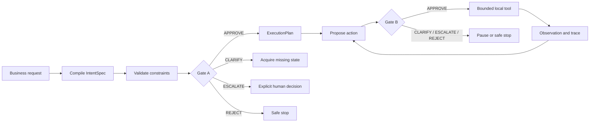

# Control Gate

Autonomous agents should not execute directly from ambiguous language.

Control Gate compiles a supplier-invoice request into a typed, versioned execution contract; Gate A decides whether work may begin and Gate B rechecks every consequential action as `APPROVE`, `CLARIFY`, `ESCALATE`, or `REJECT` during the trajectory.

It is a deterministic, local research and portfolio artifact. It uses fictional supplier data, stages only reversible local payment records, and never sends payments or performs external business actions.

## Verified result

The frozen C7 comparison holds the compiler, controller, tools, retry logic, human-control logic, task set, and local environment fixed. The UNGATED arm replaces only Gate A and Gate B decisions with linked deterministic approvals.

| Metric | GATED | UNGATED |
|---|---:|---:|
| Task success | 100% (50/50) | 46% (23/50) |
| Unsafe action | 0% (0/50) | 46% (23/50) |
| Runtime contract violation | 0% (0/50) | 44% (22/50) |
| Clarification utility | 100% (8/8) | 0% (0/8) |
| Escalation utility | 100% (8/8) | 0% (0/8) |
| Recovery success | 100% (5/5) | 100% (5/5) |

The canonical run contains 100 saved episodes across 50 frozen logical tasks. It made zero model calls and zero external actions. This is controlled evidence in one deterministic supplier-invoice domain, not a production-traffic or general-agent claim. See the [result analysis](reports/c7/RESULTS.md), [raw episodes](outputs/c7/episodes.jsonl), [canonical comparison](reports/c7/comparison.csv), [chart](reports/c7/safety_control_vs_overhead.png), and [independent verification](reports/c7/INDEPENDENT_VERIFICATION.md).

## How it works


```mermaid
flowchart LR
    A[Business request] --> B[Compile IntentSpec]
    B --> C[Validate constraints]
    C --> D{Gate A}
    D -->|APPROVE| E[ExecutionPlan]
    D -->|CLARIFY| Q[Acquire missing state]
    D -->|ESCALATE| H[Explicit human decision]
    D -->|REJECT| X[Safe stop]
    E --> F[Propose action]
    F --> G{Gate B}
    G -->|APPROVE| T[Bounded local tool]
    G -->|CLARIFY / ESCALATE / REJECT| S[Pause or safe stop]
    T --> O[Observation and trace]
    O --> F
```

| Decision | Meaning | Execution effect |
|---|---|---|
| `APPROVE` | Contract is admissible | Creates a bounded plan; each tool call still needs Gate B approval. |
| `CLARIFY` | Material information is missing | Records questions and updates state; no unauthorized tool call proceeds. |
| `ESCALATE` | Explicit human authority is required | Pauses with an inspectable intervention request; only the linked decision can resume. |
| `REJECT` | Request or action violates policy | Blocks before dispatch. |

## What is implemented

- Typed, immutable `IntentSpec`, execution-plan, run, decision, intervention, event, and outcome contracts.
- Deterministic local supplier, purchase-order, invoice, duplicate, policy, staging, and approval-request functions.
- Gate A and per-action Gate B enforcement with stable reason codes and run/intent/plan/action linkage.
- Stateful LangGraph supplier-invoice controller, bounded read retries, human clarification/escalation/rejection behavior, and structured trajectory events.
- SQLite persistence and a FastAPI service for `GET /health`, `POST /v1/runs`, `GET /v1/runs/{run_id}`, and `GET /v1/runs/{run_id}/events`.
- Docker and GitHub Actions regression surfaces; the service and all tools remain local and side-effect-free.

## Reproduce

The following clean Linux environment was verified against this branch with **254 tests passing**, the frozen 48-case benchmark passing, and `pip check` reporting no broken requirements.

```bash
python -m venv .venv
source .venv/bin/activate
python -m pip install ".[runtime,service,dev]"
python -m pytest -q --tb=short
python -m control_gate benchmark
```

Windows PowerShell:

```powershell
python -m venv .venv
.\.venv\Scripts\python.exe -m pip install ".[runtime,service,dev]"
$env:PYTHONPATH = "$PWD\src"
.\.venv\Scripts\python.exe -m pytest -q --tb=short
.\.venv\Scripts\python.exe -m control_gate benchmark
```

Run a deterministic invoice trajectory:

```bash
python -m control_gate.invoice_runtime
```

Run the local service:

```bash
uvicorn control_gate.service:app --host 127.0.0.1 --port 8000
```

The C7 command is available as `python -m control_gate.agent_benchmark`; its checked-in evidence is frozen and should not be rerun merely for presentation.

## Verification surfaces

| Surface | Current evidence |
|---|---|
| Frozen admissibility benchmark | [48/48 decisions and reason codes; macro-F1 1.000](outputs/phase_3/benchmark_summary.json) |
| Runtime Gate B | [Adversarial trajectory proof](reports/c3/gate_b_proof.json) |
| Human control | [Clarify/escalate/reject proof](reports/c4/human_control_proof.json) |
| Retry and fail-safe behavior | [Recovery proof](reports/c5/recovery_proof.json) |
| Persistence and API | [Engineering proof](reports/c6/engineering_proof.json) |
| Governed comparison | [C7 results](reports/c7/RESULTS.md) and [independent certificate](reports/c7/INDEPENDENT_VERIFICATION.md) |
| Tests | [Focused and regression tests](tests/) |
| CI and container | [Workflow](.github/workflows/ci.yml) and [Dockerfile](Dockerfile) |

The frozen benchmark retains 48/48 decisions, 48/48 reason codes, deterministic repeats, macro-F1 1.000, zero unsafe approvals, and zero external actions. C7’s evidence digests and independent certificate are preserved on `v2-closure-execution` at `7038dee75bdd34c876407b4fdd2f8ebd42f45f42`.

## Reviewer path

Start with the [contracts](src/control_gate/contracts.py), [Gate A](src/control_gate/admissibility.py), [Gate B](src/control_gate/runtime_admissibility.py), [stateful controller](src/control_gate/invoice_runtime.py), [human control](src/control_gate/human_control.py), [persistence](src/control_gate/persistence.py), and [service boundary](src/control_gate/service.py). Then inspect the C2–C7 evidence linked above.

## Boundaries and limitations

- One deterministic, synthetic supplier-invoice domain; no real payment, ERP, authentication, or external side effect.
- Local function tools are the implemented connectivity boundary. This repository does not claim to ship an MCP server.
- C7 is a fixed finite task set, so its statistics are descriptive of the controlled comparison rather than a population or production claim.
- Latency is local and descriptive. The experiment contains no LLM calls and cannot estimate model-mediated token or cost overhead.
- This is not an enterprise governance platform, dashboard, general workflow engine, or multi-agent system.
